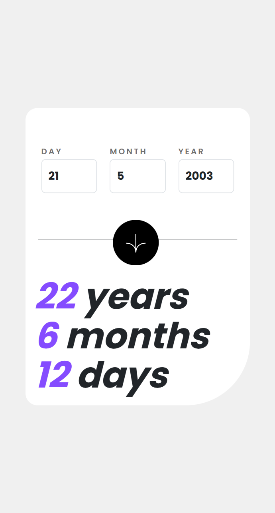
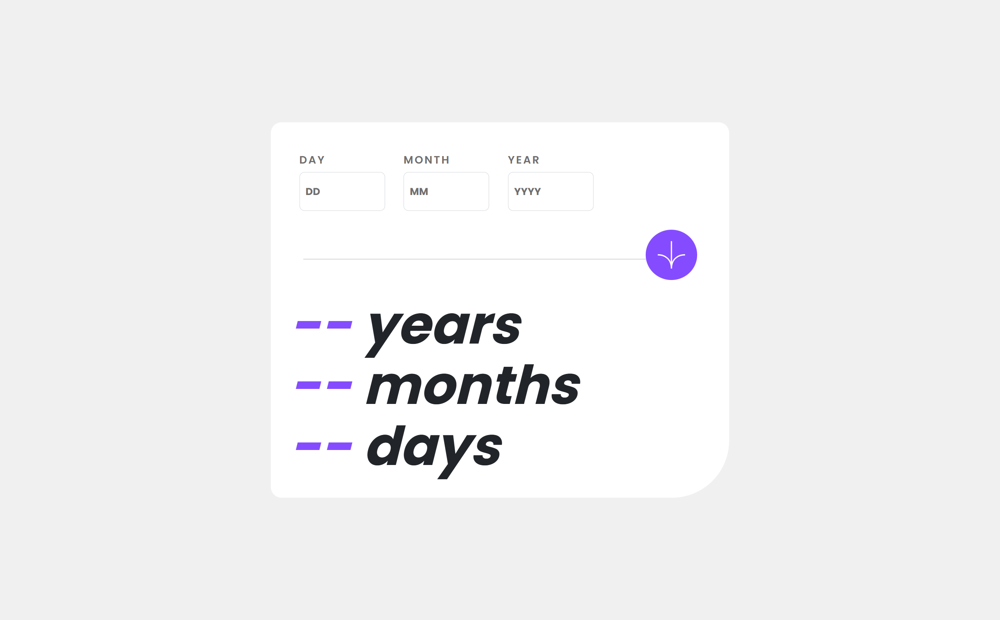
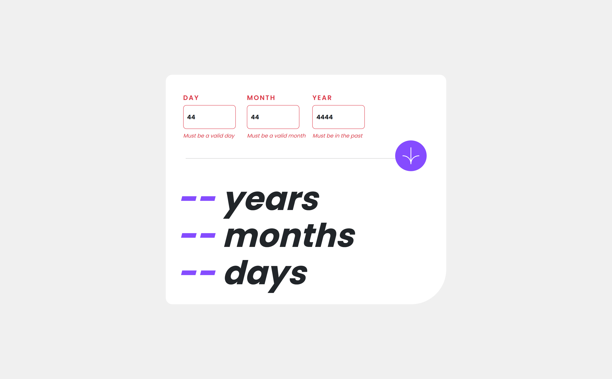
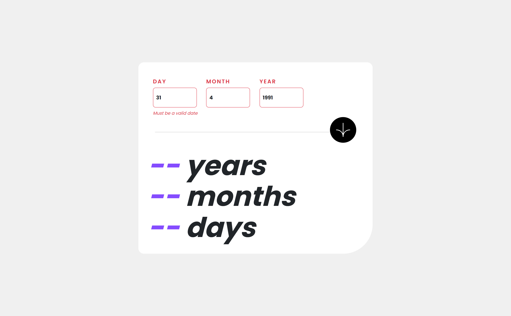

# Frontend Mentor - Age calculator app solution

This is a solution to the [Age calculator app challenge on Frontend Mentor](https://www.frontendmentor.io/challenges/age-calculator-app-dF9DFFpj-Q). Frontend Mentor challenges help you improve your coding skills by building realistic projects.

## Table of contents

- [Overview](#overview)
  - [The challenge](#the-challenge)
  - [Screenshot](#screenshot)
  - [Links](#links)
- [My process](#my-process)
  - [Built with](#built-with)
  - [Useful resources](#useful-resources)
- [Author](#author)

## Overview

### The challenge

Users should be able to:

- View an age in years, months, and days after submitting a valid date through the form
- Receive validation errors if:
  - Any field is empty when the form is submitted
  - The day number is not between 1-31
  - The month number is not between 1-12
  - The year is in the future
  - The date is invalid e.g. 31/04/1991 (there are 30 days in April)
- View the optimal layout for the interface depending on their device's screen size
- See hover and focus states for all interactive elements on the page

### Screenshot

Mobile Phone Design

Desktop Design

Desktop Error Empty

Desktop Error Invalid

Desktop Error Whole Form

### Links

- Solution URL: [GitHub Repo](https://github.com/lianxxxx/age-precision-app-react)
- Live Site URL: [via Vercel](https://your-live-site-url.com)

## My process

### Built with

- Semantic HTML5 markup
- CSS custom properties
- Flexbox
- Mobile-first workflow
- [React](https://reactjs.org/) - JS library
- [Vite](https://vite.dev/) - build tool and development server
- [Bootstrap](https://styled-components.com/) - CSS framework for styling

### Useful resources

- [Google Fonts](https://fonts.google.com/specimen/Poppins) - The project uses the Poppins font from Google Fonts, a widely documented and easily accessible resource, which helped simplify the development process.

## Author

- GitHub - [Leyanne](https://github.com/lianxxxx)
- Frontend Mentor - [@lianxxxx](https://www.frontendmentor.io/profile/lianxxxx)
